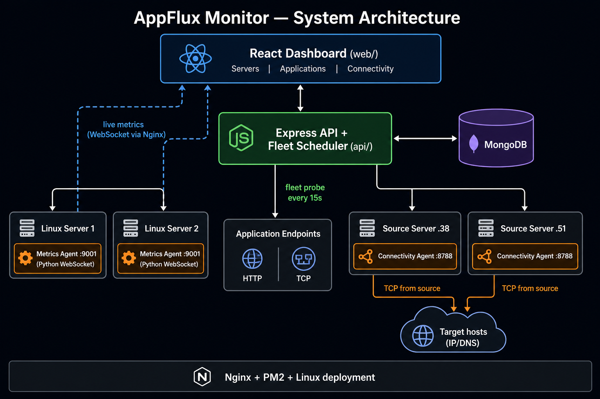

# Infra Pulse

**Full-stack infrastructure monitoring platform** for operations teams — realtime host metrics, application uptime, network path checks, incidents, and alerting in one dashboard.

> This public repository contains **documentation** and a **static UI preview** only.  
> Application source code is **not** published here.

| | |
|---|---|
| **Live demo** | https://mahfuztoolbox.github.io/infra-pulse/ |
| **Architecture** | [images/architecture.png](images/architecture.png) |
| **Role** | End-to-end design & implementation (agents, API, UI, deployment) |
| **Stack** | React · TypeScript · Node.js · Express · MongoDB · Python · WebSocket · Nginx · PM2 |

---

## Why Infra Pulse?

Typical monitoring tools answer only part of the picture. Infra Pulse combines four operational views:

1. **Host metrics** — what is happening *on* each server right now  
2. **Application probes** — are business APIs / services reachable?  
3. **Connectivity paths** — can *source host A* reach *target B* (not only “can the monitor box ping B”)?  
4. **Network devices** — inventory and status for network assets in the same console  

…plus **RBAC**, **incidents**, and **multi-channel alerts** when something fails.

---

## Features

### 1. Server / host monitoring (realtime)

Lightweight **Python agents** on each Linux host stream a full metrics snapshot over **WebSocket** (typically every few seconds).

| Area | What operators see |
|------|---------------------|
| **CPU** | Overall %, per-core load, frequency, load averages |
| **Memory** | RAM used / available / %, swap |
| **Storage** | Disk mounts — capacity, used %, read/write counters |
| **Network** | Per-NIC status, IPs, speed/MTU, bytes/packets, errors/drops, live RX/TX rates |
| **Connections** | TCP/UDP overview, top remote peers, peer drill-down |
| **Processes** | Top processes by CPU/memory, app identity, per-process network rates |
| **Services** | Watched system services (active / inactive) |
| **Security posture** | Listening ports, SSH hardening signals, firewall/update hints (read-only) |
| **Alerts** | Threshold warnings/criticals for CPU, RAM, disk, interface down, drops |

Fleet UI: category columns, live UP/DOWN/ALERT counts, server detail pages, heartbeat history, and agent reachability checks from the API.

### 2. Application monitoring

- Register applications with one or more **HTTP / TCP endpoints**
- Background **fleet probe scheduler** (concurrent, interval-based — not click-to-probe)
- Up / down status, latency-oriented results, incident hooks on failure
- Roles / categories for organizing large application fleets

### 3. Connectivity monitoring

- Define **flows**: source host → target host/IP + port  
- Probes run **from the source machine** via a small connectivity agent (real path validation)
- Topology-style views and live **peer traffic** samples (RX/TX) when sockets exist
- Useful for app→DB, branch→core, and multi-tier path checks

### 4. Network inventory

- Network device / category registry alongside servers and apps  
- Unified navigation under the same dashboard shell

### 5. Incidents, alerts & notifications

- Incident lifecycle (open → acknowledge → resolve)  
- Resource and application failure correlation  
- Notification channels: **email / SMS / Telegram** (configurable)  
- Notification **delivery log** for auditability  

### 6. Access control & admin

- Login-based access with **RBAC** (permissions for monitor / reports / configuration)  
- Admin registries: servers, applications, connectivity flows, network, users  
- App settings (title, branding, intervals) without redeploying UI code  

### 7. Operations & deployment

- Production-oriented layout: Nginx (UI) · PM2 (API) · systemd/daemon agents  
- Env-based configuration, reverse-proxy friendly WebSocket paths  
- Designed for multi-host fleets (API host ≠ monitored hosts ≠ connectivity sources)

---

## Architecture



```text
Browser (React SPA)
        │  HTTPS /api
        ▼
Express API  +  MongoDB
   │         │
   │         ├── fleet probe scheduler ──► application endpoints (HTTP/TCP)
   │         └── connectivity orchestration ──► agents on source hosts
   │
   └── UI also opens WebSocket streams ──► metrics agents on each server (:9001)
```

| Component | Role |
|-----------|------|
| **Web UI** | React + TypeScript SPA (Nginx static hosting) |
| **API** | Express REST — registries, probes, incidents, notifications, RBAC |
| **MongoDB** | Configuration, incidents, delivery logs, settings |
| **Metrics agent** | Python daemon — CPU/RAM/disk/network/process/service snapshots over WebSocket |
| **Connectivity agent** | Node service on source hosts — TCP path checks + traffic samples |

---

## Tech stack

| Layer | Technologies |
|-------|----------------|
| Frontend | React, TypeScript, Vite, React Router |
| Backend | Node.js, Express, MongoDB driver |
| Agents | Python (`psutil`, `websockets`), Node connectivity agent |
| Realtime | WebSocket metrics broadcast |
| Runtime ops | Linux, Nginx, PM2, systemd |

---

## Product modules (UI map)

| Nav area | Pages |
|----------|--------|
| **Monitor** | Servers · Applications · Connectivity · Network |
| **Reports** | Incident reports · Notification log |
| **Configuration** | Manage servers / applications / connectivity / network · user access · settings · notification channels |

---

## Static demo

Because source code stays private, a **static UI preview** is published on GitHub Pages:

**Open the demo:** https://mahfuztoolbox.github.io/infra-pulse/

1. Open the URL above (`index.html` on GitHub Pages)  
2. On the **Sign in** screen, click **Sign in**  
3. The **Servers dashboard** preview loads (sample cards — not live agents)

Documentation for this project is this **`README.md`** file only (rendered on the GitHub repository page).

---

## Key capabilities

- **End-to-end platform** — host agents, REST API, realtime dashboard, and production deployment model  
- **Deep host telemetry** — CPU, memory, storage, network, processes, services, and socket-level views (not uptime-only)  
- **Fleet application probing** — scheduled HTTP/TCP checks across many endpoints  
- **Source-based connectivity** — path validation from real source hosts to targets  
- **Operations workflow** — RBAC, incident lifecycle, and multi-channel alerts with delivery audit  

---

## Repository contents

| Path | Description |
|------|-------------|
| `README.md` | Project documentation (this file) |
| `index.html` | Static login → dashboard UI (served at the Live demo URL) |
| `images/architecture.png` | Architecture diagram |
| `docs/screenshots/` | Optional sanitized screenshots |
| `deploy-github.sh` | Helper to publish portfolio updates |

No application source, secrets, or private keys are included.

---

## License

Portfolio / demonstration materials. Application source remains private.
